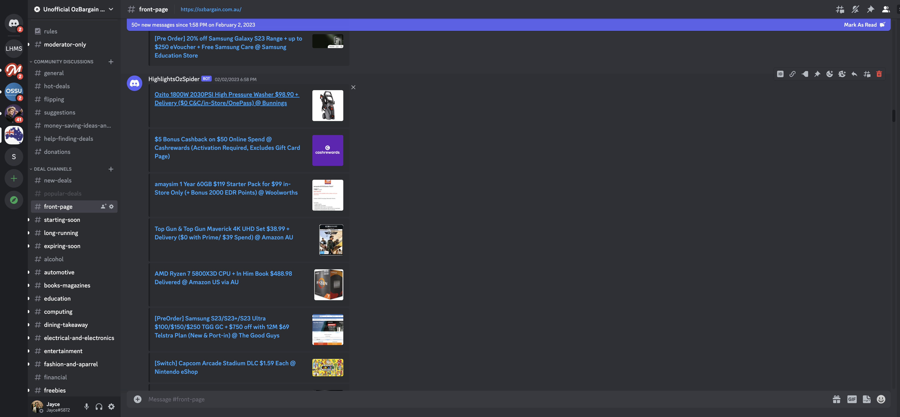

# OzBargain Web Scraper

Webscraper that kept [27+ discord channels](https://discord.gg/FrdETzHC3S) updated hourly with categorized deals
from [Oz Bargain](https://ozbargain.com.au) via discord webhooks.

<table>
    <tr>
        <th>Front Page Channel</th>
        <th>Starting Soon Channel</th>
    </tr>
    <tr>
        <td>
            
        </td>
        <td>
            
        </td>
    </tr>
    <tr>
        <th>Freebies Channel</th>
        <th>Home & Garden Channel</th>
    </tr>
    <tr>
        <td>
            
        </td>
        <td>
            
        </td>
    </tr>
</table>

## Stack / Infrastructure

- Python `AWS Lambda` 
- `AWS DynamoDB` for persistence
- Containerised and deployed to `AWS ECS/ECR`

## Short History
- Previously used twilio SMS notification service
- Updated to use discord & update a set of channels instead via webhooks & a JSON file.
- Refactored to `AWS Lamda`, `AWS ECS` and `AWS ECR` for implementation & DynamoDB for storage.
